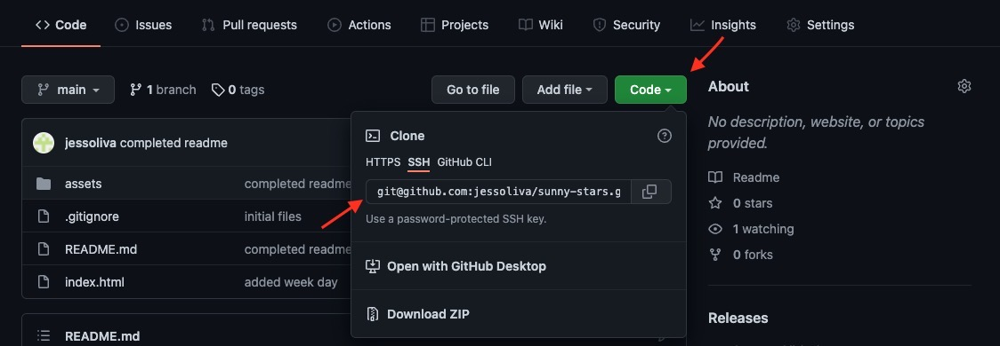

# Eazy Peazy README Squeazy

Tired of a creating a README.md for your super cool project?\
Do you stay up at night wondering which sections to include in your README.md?\
Just use this Eazy Peazy README Squeazy app for your readme needs.

## 📚&nbsp; Table of Contents

- [📝&nbsp;  Description](#description)
- [🛠️&nbsp; Installation](#installation)
- [👩🏽‍💻&nbsp; Usage](#usage)
- [✏️&nbsp; Contribution Guidelines](#contribution-guidelines)
- [👨‍👩‍👧‍👦&nbsp; Credits](#credits)
- [📱&nbsp; Contact](#contact)
- [📰&nbsp; License](#license)

## 📝&nbsp; Description
A command-line application that accepts user input, using that input a wonderful README.md file is generated for you! The generated README.md file will be located in the dist folder. In there you can make any necessary final changes.

## 🛠️&nbsp; Installation

On the main page of the read-chiquis repository click on 'Fork' on the right hand side. This will clone the repository onto your GitHub!

&emsp;&emsp;&emsp; 

Then go to the main page of the forked repository on your GitHub and click on '<> Code'. From there, copy your preferred URL to clone the repository onto your computer. My go to is SSH!

&emsp;&emsp;&emsp; 

Go to your terminal or the VSCode terminal, cd into the directory you want the cloned repository to be located in and enter the following command and replace the placeholder with the URL link you copied:

    git clone <INSERT-COPIED-URL>

Next, open the repository you cloned in Visual Studio Code. In the terminal enter the following command to install the dependencies required for the app:

    npm i

Now the read-chiquis repository is on your GitHub and local computer, and ready to be used! 

## 👩🏽‍💻&nbsp; Usage

To use, run the following command:

    node server

Checkout this video ✨

## ✏️&nbsp; Contribution Guidelines

## 🧪&nbsp; Tests
No tests written yet!

## 👨‍👩‍👧‍👦&nbsp; Credits

- [W3Schools](https://www.w3schools.com/)

## 📱&nbsp; Contact

If you have any questions related to this project, or you just want to interact, you can reach me via GitHub or E-mail!

> Github: [jess-oliva](https://github.com/jess)

> E-mail: [jessoliva.g@gmail.com](mailto:jess)

## 📰&nbsp; License

    Copyright 2022 Jessica Olivares

Permission is hereby granted, free of charge, to any person obtaining a copy of this software and associated documentation files (the "Software"), to deal in the Software without restriction, including without limitation the rights to use, copy, modify, merge, publish, distribute, sublicense, and/or sell copies of the Software, and to permit persons to whom the Software is furnished to do so, subject to the following conditions:

The above copyright notice and this permission notice shall be included in all copies or substantial portions of the Software.

THE SOFTWARE IS PROVIDED "AS IS", WITHOUT WARRANTY OF ANY KIND, EXPRESS OR IMPLIED, INCLUDING BUT NOT LIMITED TO THE WARRANTIES OF MERCHANTABILITY, FITNESS FOR A PARTICULAR PURPOSE AND NONINFRINGEMENT. IN NO EVENT SHALL THE AUTHORS OR COPYRIGHT HOLDERS BE LIABLE FOR ANY CLAIM, DAMAGES OR OTHER LIABILITY, WHETHER IN AN ACTION OF CONTRACT, TORT OR OTHERWISE, ARISING FROM, OUT OF OR IN CONNECTION WITH THE SOFTWARE OR THE USE OR OTHER DEALINGS IN THE SOFTWARE.
